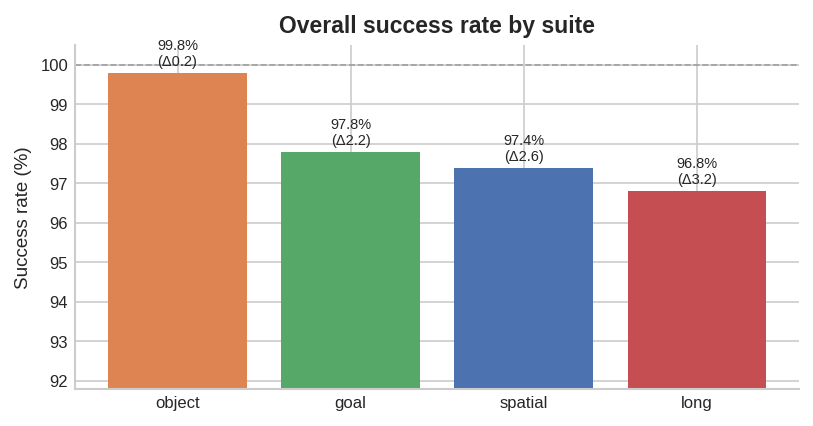
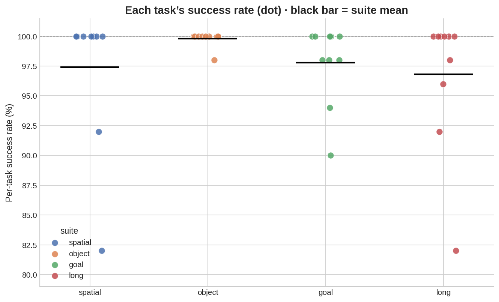
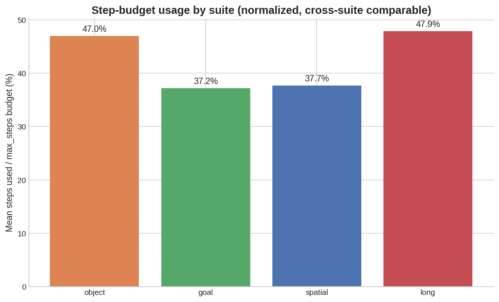
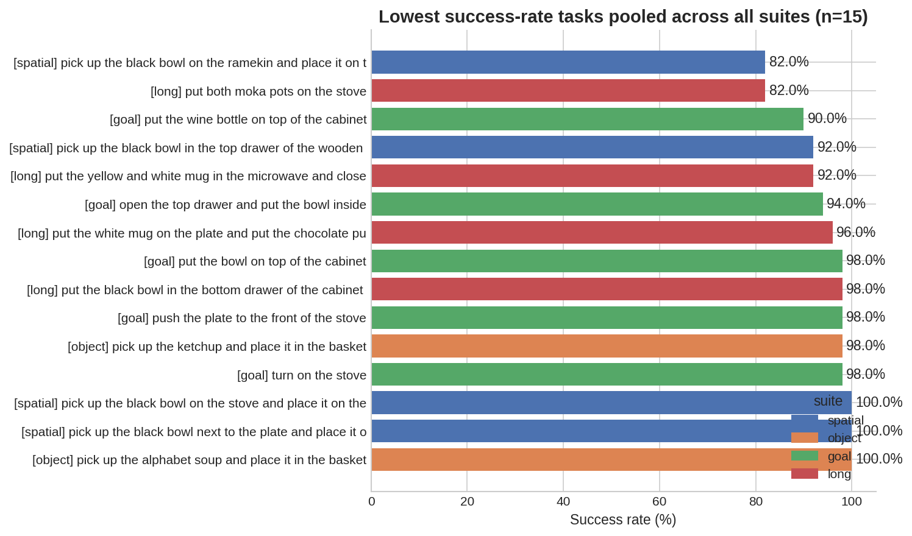

# MolmoAct2 × LIBERO Evaluation: Pick and Parse

**Analyzing the Impact of Visual Scene Complexity on Robot Manipulation with MolmoAct2**

Team: Pick and Parse (Priyadarshini Rajmohan, Poojitha Alam, Mounika Akkenapragada), CSE D 504

MolmoAct2 (Allen Institute for AI, 2026) is a recent open Vision-Language-Action (VLA) model with an embodied-reasoning VLM backbone (Molmo2-ER), full LIBERO evaluation support, and public checkpoints. This repo runs MolmoAct2 (`allenai/MolmoAct2-LIBERO-LeRobot`) on all four [LIBERO](https://github.com/Lifelong-Robot-Learning/LIBERO) suites (Spatial, Object, Goal, Long 40 tasks × 50 episodes = 2,000 episodes) as an **inference-only** pipeline. We extract scene-complexity features from simulator/BDDL state (object counts, gripper-to-target distance, distractor density) with no extra vision models, and we analyze where MolmoAct2 succeeds vs fails

## Research question

How does MolmoAct2's task success rate vary across LIBERO task suites, and which scene properties (object density, spatial layout, task length, distractor density: n_distractors / total_objects named in the instruction) explain where the model succeeds vs. fails?

- **Minimal goal:** per-task success rates across all 2,000 episodes a baseline profile of which suite is easiest/hardest.
- **Ambitious goal:** Spearman correlation between scene properties and success rate, a qualitative failure gallery, and (in the follow-on NLP phase) whether visual clutter and distractor density are correlated predictors of failure.
- **Success criterion:** Deliver suite and task level success rates for all four LIBERO suites under a fixed MolmoAct2 protocol, plus Spearman tests of scene properties vs success. A large suite gap or |r| > 0.3 with p < 0.05 would indicate complexity-sensitive failures, a null/weak result is also valid, especially if scene properties vary little within suites.

## Motivation

As VLA models move closer to real-world robotic deployment, aggregate task success rates alone are insufficient to assess their reliability. A model that performs well overall may still fail in visually cluttered, spatially complex, or long-horizon environments. Characterizing these failure conditions gives deeper insight into model behavior, supporting the development of more robust VLA systems and their safe deployment.

## Use cases

This analysis can help VLA researchers improve model architectures, benchmark designers create more diagnostic evaluation tasks, and robotics practitioners identify conditions where additional safeguards may be needed before deployment in settings such as manufacturing, logistics, healthcare, and domestic assistance.

## Approach & rationale

Why this design, specifically:

- **Scene properties come from the simulator, not a second vision model.** Object count, distractor density, and gripper-to-target distance are read directly from LIBERO's own state (BDDL files, sim positions) rather than estimated by a detector. That removes a whole source of noise/confound from the analysis: any correlation we find is between MolmoAct2's behavior and *ground-truth* scene complexity, not between MolmoAct2 and some other model's guess at scene complexity. It's also free: zero extra GPU time, per the proposal's constraint.
- **LIBERO's four suites double as the complexity axis.** Rather than inventing a new complexity metric, we use Spatial/Object/Goal/Long as-is: LIBERO's own designers already ordered these by increasing difficulty, so suite label is a pre-validated proxy we don't have to justify from scratch.
- **Distractor density is defined from the BDDL ground truth** (`n_distractors / total_objects`), rather than estimated from camera images.. Same reasoning as above: deterministic and reproducible, not dependent on a second model's accuracy.
- **Spearman, not Pearson, for the correlation analysis.** Success rate is bounded in [0, 1] and scene properties (object count, distance) aren't guaranteed to relate to it linearly. Spearman only assumes a monotonic relationship, which is the weaker, more defensible assumption here.
- **Fixed eval seed, per-episode seeding, and LIBERO's built-in init states** (`--eval_seed 1000`, `--per_episode_seed`, `--use_init_states`) match the protocol MolmoAct2's own published LIBERO numbers were evaluated under, so our success rates are comparable to prior reported results rather than an artifact of a different eval setup.

## Requirements

- **GPU:** MolmoAct2 inference at `bfloat16` uses ~14 GB VRAM. A full suite (50 episodes × 10 tasks) takes roughly 1–2 hours on CUDA, CPU/MPS is much slower and only recommended for a smoke test.
- **Python:** 3.12 (3.13 also confirmed working with the pinned `lerobot==0.6.0`).
- **Disk:** ~10 GB for the MolmoAct2 checkpoint (downloaded automatically, cached by `huggingface_hub`).
- **LIBERO** requires MuJoCo and a rendering backend (EGL headless on Linux+CUDA, native OpenGL elsewhere). See platform notes below.

## Setup

### 1. Create the environment (macOS / Linux / Windows)

```bash
conda create -n molmoact2-libero python=3.12
conda activate molmoact2-libero
```

### 2. Install LeRobot with LIBERO extras

```bash
pip install "lerobot[libero]"
```

**Linux only**: LeRobot's LIBERO extra needs these build deps first:

```bash
sudo apt-get install cmake build-essential python3-dev pkg-config \
  libavformat-dev libavcodec-dev libavdevice-dev libavutil-dev \
  libswscale-dev libswresample-dev libavfilter-dev
```

### 3. Install ffmpeg (for the failure-video writer)

```bash
conda install ffmpeg -c conda-forge
```

macOS/Linux verify:
```bash
ffmpeg -encoders 2>/dev/null | grep libsvtav1
```
Windows (PowerShell) verify:
```powershell
ffmpeg -encoders 2>$null | Select-String libsvtav1
```

### 4. Clone and install LIBERO

`libero` isn't on PyPI, so clone the official repo and install it editable. This is what the `-e` line in `requirements.txt` originally pointed to on a contributor's machine, and what you need to reproduce locally:

```bash
git clone https://github.com/Lifelong-Robot-Learning/LIBERO.git
cd LIBERO
pip install -e .
cd ..
```

If `import libero` still fails afterward, point site-packages at it directly:
```bash
python -c "import site; print(site.getsitepackages()[0])"
# then append your LIBERO path to a .pth file in that directory, e.g.:
#   echo "/path/to/LIBERO" >> <site-packages>/libero.pth      (macOS/Linux)
#   echo C:\path\to\LIBERO >> <site-packages>\libero.pth      (Windows)
```
When LIBERO prompts *"Do you want to specify a custom path for the dataset folder? (Y/N)"*, answer **N**.

### 5. Install remaining pinned dependencies

```bash
pip install -r requirements.txt
```

This installs `robosuite==1.4.1`, `bddl==1.0.1`, `gym==0.25.2`, `pandas`, `scipy`, `matplotlib`, etc., all version-pinned because LIBERO/robosuite/bddl are sensitive to version drift.

### 6. Rendering backend

- **Linux + CUDA:** `eval_molmoact2.py` auto-enables EGL headless rendering (`MUJOCO_GL=egl`, `PYOPENGL_PLATFORM=egl`); no action needed. Override with `--use_egl` / `--no-use_egl` if needed.
- **macOS / Windows:** EGL headless isn't available; the script leaves rendering on the platform default (a display/GL context is required; this is what `OffScreenRenderEnv` uses under the hood). If you hit MuJoCo/OpenGL errors on Windows, running under WSL2 (treated as Linux) is the most reliable path for unattended/headless runs.

### 7. Verify the install

```bash
python -c "from libero.libero import benchmark; print('libero OK')"
python -c "from robosuite.environments.manipulation.single_arm_env import SingleArmEnv; print('robosuite OK')"
python -c "import bddl; print('bddl OK')"
python -c "import torch; print('CUDA:', torch.cuda.is_available())"
nvidia-smi   # confirms GPU visibility if using --device cuda
```

The MolmoAct2 checkpoint (`allenai/MolmoAct2-LIBERO-LeRobot`, Apache 2.0, ~10 GB) downloads automatically on first run via `from_pretrained`, no manual download step.

## Usage

Run one suite at a time:

```bash
python eval_molmoact2_spatial_object.py --suite libero_spatial --n_episodes 50 --device cuda
python eval_molmoact2_spatial_object.py --suite libero_object  --n_episodes 50 --device cuda
python eval_molmoact2.py --suite libero_goal    --n_episodes 50 --device cuda
python src/eval_molmoact2_mounika_v2.py --suite libero_10 --n_episodes 50 --device cuda

```

(`libero_10` is LIBERO's internal name for the Long suite.) For a quick smoke test before a full overnight run, use `--n_episodes 1` and `--device cpu`.

Key flags (see `python eval_molmoact2.py --help`,`python eval_molmoact2_spatial_object.py --help` for the full list):

| Flag | Default | Notes |
|---|---|---|
| `--suite` | *required* | `libero_spatial`, `libero_object`, `libero_goal`, or `libero_10` |
| `--n_episodes` | 50 | Episodes per task |
| `--device` | `cuda` | `cuda`, `mps`, or `cpu` |
| `--output_dir` | `outputs/custom_eval` | Root output directory |
| `--eval_seed` | 1000 | Matches MolmoAct2's published eval protocol |
| `--num_steps_wait` | 50 | Settle steps after reset, matches MolmoAct2 protocol |
| `--use_init_states` / `--no-use_init_states` | on | Use LIBERO's fixed per-episode init states (reproducibility) |
| `--per_episode_seed` / `--no-per_episode_seed` | on | Derive episode seed as `eval_seed + episode_idx`; off reuses `eval_seed` for every episode |
| `--use_egl` / `--no-use_egl` | auto | Force EGL headless rendering on/off; auto-detects Linux+CUDA if omitted |
| `--save_fail_videos` | off | Rarely needed manually; the script already auto-enables failure videos for all four suites ([eval_molmoact2.py:96](src/eval_molmoact2.py#L96)) |

Each suite takes roughly 1–2 hours on CUDA at `n_episodes=50`; total GPU time for all four suites is ~4–6 hours. Runs are independent per suite and can be split across teammates/machines and merged afterward (all outputs key on `task_id`).

### Team assignments (this run)

| Teammate | Suite(s) | Episodes | Device | Time |
|---|---|---|---|---|
| Priya | `libero_object`, `libero_spatial` | 500 + 500 = 1,000 | CUDA | ~30–45 min each |
| Poojitha | `libero_goal` | 500 | CUDA | ~30–45 min |
| Mounika | `libero_10` (Long) | 500 | CUDA | ~45–60 min |

```bash
# Priya
python eval_molmoact2_spatial_object.py --suite libero_object  --n_episodes 50 --device cuda
python eval_molmoact2_spatial_object.py --suite libero_spatial --n_episodes 50 --device cuda

# Poojitha
python eval_molmoact2.py --suite libero_goal --n_episodes 50 --device cuda

# Mounika
python src/eval_molmoact2_mounika_v2.py --suite libero_10 --n_episodes 50 --device cuda
```

After all four suites finish, merge each suite's `nlp_analysis_table.csv` (see **Analysis**) before running the correlation analysis.

## Troubleshooting

- **LIBERO/MuJoCo/robosuite version mismatches** are the most common setup failure. Stick to the pinned versions in `requirements.txt` (`robosuite==1.4.1`, `bddl==1.0.1`, `gym==0.25.2`); LIBERO is sensitive to drift here.
- **`import libero` fails after `pip install -e .`:** confirm the `.pth` file (Setup step 4) points at the cloned LIBERO directory, and that you're in the same conda env you installed it into.
- **OOM on GPU:** MolmoAct2 needs ~14 GB VRAM at `bfloat16`; free other processes or fall back to `--device cpu` for a reduced-episode smoke test.
- **No visible GPU:** check with `nvidia-smi`; use `--device cpu` (slow) or `--device mps` on Apple Silicon.
- **Crashed suite mid-run:** `results.csv` is appended per-episode (survives crashes); re-running the same `--suite` will overwrite prior results for that suite, so back up partial CSVs first if you want to keep them.

## Data Requirements

- **LIBERO Simulation Environment**: open-source robot manipulation benchmark (MIT License), available via `pip install lerobot[libero]`. Provides 40 manipulation tasks across four task suites (Spatial, Object, Goal, and Long), including RGB observations, language instructions, and simulator state for evaluating VLA models. Benchmark repository: https://github.com/Lifelong-Robot-Learning/LIBERO. Requires Linux with the MuJoCo rendering backend (`MUJOCO_GL=egl`) for evaluation.

- **Scene State Data**: scene properties, including object count and initial gripper-to-target distance, are extracted directly from the LIBERO simulator state at the start of each episode. These features are used to analyze the relationship between visual scene complexity and task success.

- **MolmoAct2-LIBERO-LeRobot Checkpoint**: Apache 2.0 licensed, publicly available pretrained model hosted on Hugging Face (~10 GB). Fine-tuned specifically for all four LIBERO task suites; serves as the VLA model evaluated in this project. Model repository: https://huggingface.co/allenai/MolmoAct2-LIBERO-LeRobot.

- **GPU Server (24 GB VRAM)**: MolmoAct2 inference requires approximately 14 GB of VRAM using bfloat16 precision. Running the planned 2,000 evaluation episodes is expected to require 4–6 hours of GPU time. Scene property extraction and subsequent data analysis are performed on the CPU using Python libraries such as pandas and matplotlib.

## Input

At every control step, `eval_molmoact2.py` assembles a `mapped_obs` dict ([eval_molmoact2.py:380-411](src/eval_molmoact2.py#L380-L411)) and runs it through `env_preprocessor` (`LiberoProcessorStep`) then `preprocessor` (MolmoAct2's tokenize/normalize/pack pipeline) before calling `policy.select_action()`. The model receives:

- **Two RGB camera views**, each `(1, C, H, W)` float32, normalized to `[0, 1]`:
  - `agentview_image` → `observation.images.image` (third-person view)
  - `robot0_eye_in_hand_image` → `observation.images.wrist_image` (wrist camera)
  - Camera mapping follows the official checkpoint's convention ([eval_molmoact2.py:203-206](src/eval_molmoact2.py#L203-L206)). Both are rendered at 256×256 by `OffScreenRenderEnv` and flipped 180° to correct MuJoCo/OpenGL's orientation convention.
- **Robot proprioceptive state**, nested and batched into an 8-D vector by `LiberoProcessorStep` ([eval_molmoact2.py:393-408](src/eval_molmoact2.py#L393-L408)):
  - end-effector position `robot0_eef_pos` (3-D)
  - end-effector orientation `robot0_eef_quat` (4-D)
  - gripper joint position `robot0_gripper_qpos` (2-D, only 1 dim used downstream)
- **Natural language instruction**: the task's `task.language` string from the LIBERO/BDDL task definition, passed as `task` ([eval_molmoact2.py:411](src/eval_molmoact2.py#L411)).

## Output

- **Per inference step:** a continuous 7-DoF action (`dx, dy, dz, droll, dpitch, dyaw, gripper`), predicted with `inference_action_mode="continuous"` ([eval_molmoact2.py:424-427](src/eval_molmoact2.py#L424-L427)), unnormalized by `postprocessor`, then applied to the simulator via `env.step(action_np)`.
- **Per episode:** a success flag, step count, seed, and (for episode 0 or on failure) a saved frame/video, written as one row to `results.csv` ([eval_molmoact2.py:459-475](src/eval_molmoact2.py#L459-L475)).
- **Per task:** aggregated success rate + scene properties (object counts, distractor density, initial gripper-to-target distance) written to `scene_properties.csv` / `distractor_density.csv`.
- **Per run:** all of the above merged into `nlp_analysis_table.csv`, plus `eval.log`, initial/failure frames, and failure videos; full list in **Repository contents** below.

## Metrics used for evaluation

All computed directly in `eval_molmoact2.py` / the CSVs it produces, no external eval harness:

- **Episode success (binary)**: an episode is marked successful the instant the environment reward exceeds zero (`reward > 0`), which ends the episode early ([eval_molmoact2.py:433-435](src/eval_molmoact2.py#L433-L435)).
- **Steps to completion (`n_steps`)**: number of environment steps taken before success or before hitting the suite's step cap, `TASK_MAX_STEPS` ([eval_molmoact2.py:54-59](src/eval_molmoact2.py#L54-L59)): 280 (Spatial/Object), 300 (Goal), 520 (Long).
- **Per-task success rate**: `task_successes / n_episodes * 100`, logged at the end of each task's episode loop ([eval_molmoact2.py:482-483](src/eval_molmoact2.py#L482-L483)).
- **Per-suite success rate**: `df.groupby("suite")["success"].mean() * 100` over all logged episodes, the top-line summary metric printed at the end of a run ([eval_molmoact2.py:511](src/eval_molmoact2.py#L511)).
- **Average steps per task (`avg_steps`)**: mean `n_steps` grouped by `task_id`/`suite`, included in `nlp_analysis_table.csv` ([eval_molmoact2.py:514-519](src/eval_molmoact2.py#L514-L519)).
- **Distractor density**: `n_distractors / total_objects` per task, parsed from the BDDL file's object/target lists ([eval_molmoact2.py:236-258](src/eval_molmoact2.py#L236-L258)); used as an independent variable against success rate, not a success metric itself.
- **Initial gripper-to-target distance**: Euclidean norm between the gripper site position and the target object's body position at episode start ([eval_molmoact2.py:309-330](src/eval_molmoact2.py#L309-L330)); the other independent variable for the correlation analysis (see **Analysis**).

## Repository contents

| File                                                                                    | Purpose                                                                                                                  |
| --------------------------------------------------------------------------------------- | ------------------------------------------------------------------------------------------------------------------------ |
| [eval\_molmoact2.py](src/eval_molmoact2.py) | eval script used for the Goal (success, steps, scene properties, fail videos)|
| [eval\_molmoact2\_spatial\_object.py](src/eval_molmoact2_spatial_object.py) | Suite-specific eval script used for the Object and Spatial suites and additionally logs grasp/close events, nearest object at first close, pick/place distances, path length, timeout, and `likely_recovery` for failure-mode analysis. |
| [eval\_molmoact2\_mounika\_v2.py](src/eval_molmoact2_mounika_v2.py) | Eval script used for the Long / `libero_10` suite. It keeps the same MolmoAct2 inference/action logic and adds chunk/resume controls used to complete the 500-episode run robustly. |
| [Libero\_10\_analysis.pdf](docs/Libero_10_analysis.pdf) | Long / LIBERO_10 analysis report with task-level results, failure analysis, plots, and manual subgoal review. |
| [GLOSSARY.md](docs/GLOSSARY.md) | Definitions of LIBERO/MolmoAct2 terms used throughout this repo. |
| [LIBERO\_Object\_Spatial\_Detailed\_Analysis.pdf](docs/LIBERO_Object_Spatial_Detailed_Analysis.pdf) | Full Object/Spatial findings — per-task breakdowns, failure mechanisms, evidence tables. Referenced from the Object/Spatial analysis sections below. |
| [requirements.txt](requirements.txt) | Pinned Python dependencies (see note on LIBERO below, it isn't pip-installable from PyPI and must be cloned separately). |


Running the eval scripts listed above generates the standard analysis outputs. For the Long / `libero_10` suite, the finalized outputs are committed under `results/libero_10/`.

| Output | Contents |
|---|---|
| `eval.log` | Timestamped run log (also printed to console). |
| `results.csv` | Per-episode success, step count, seed, distractor fields. |
| `scene_properties.csv` | Per-task BDDL/simulator metrics: object counts, distractor density, initial gripper-to-target distance. |
| `distractor_density.csv` | NLP-phase subset: `task_id, suite, total_objects, target_objects, distractor_density, n_distractors`. |
| `nlp_analysis_table.csv` | `scene_properties.csv` merged with per-task success rate: the table the correlation analysis reads. |
| `frames/` | One initial scene frame per task (episode 0). |
| `frames/failures/` | Up to 3 failure frames per task. |
| `videos/failures/` | MP4 of up to 3 failed episodes per task. |

## Analysis

Once one or more suites have been run, each suite folder contains results.csv (per-episode success) and scene_properties.csv (per-task sim/BDDL features). Aggregate success by task, merge with scene properties, concatenate across suites, and run the correlation analysis:

```python
import pandas as pd
from scipy.stats import spearmanr
from pathlib import Path

def load_suite(suite_dir: str) -> pd.DataFrame:
    root = Path(suite_dir)
    results = pd.read_csv(root / "results.csv")
    props = pd.read_csv(root / "scene_properties.csv")

    task_sr = (
        results.groupby(["task_id", "suite"], as_index=False)
        .agg(
            success_rate=("success", "mean"),
            n_episodes=("success", "count"),
            avg_steps=("n_steps", "mean"),
        )
    )
    return task_sr.merge(props, on=["task_id", "suite"], how="left")

df = pd.concat([
    load_suite("outputs/custom_eval_recovery/libero_spatial"),
    load_suite("outputs/custom_eval_recovery/libero_object"),
    load_suite("outputs/custom_eval_500/libero_goal"),
    load_suite("outputs/custom_eval_500/libero_10"),  # when available
], ignore_index=True)

# Primary CV result: suite-level success rate
suite_success = df.groupby("suite")["success_rate"].mean()

# Scene-property correlations (CV)
dist = df[df["initial_distance"] >= 0]  # drop invalid Goal distances (-1)
r_dist, p_dist = spearmanr(dist["initial_distance"], dist["success_rate"])
r_obj, p_obj   = spearmanr(df["n_objects_sim"], df["success_rate"])
r_dd, p_dd     = spearmanr(df["distractor_density"], df["success_rate"])

print(suite_success)
print("initial_distance", r_dist, p_dist)
print("n_objects_sim", r_obj, p_obj)
print("distractor_density", r_dd, p_dd)
```

Suggested figures (per the project plan):
1. Suite-level success rate bar chart (primary CV result).
2. Task-level success rate heatmap within each suite.
3. Success rate vs. suite complexity scatter (Spatial=1, Object=2, Goal=3, Long=4).
4. Distractor density vs. success rate scatter, colored by suite (primary NLP result).
5. Qualitative failure gallery: hand-picked frames from `frames/failures/`, pairing easy (high-success) vs. hard (low-success) scenes.

## Results & conclusions

### Suite-level success rates (primary CV result)

| Suite | Success rate | Episodes run | Perfect tasks ( /10) | Min task SR | Avg steps  | Notes |
|---|---|---|---|---|---|---|
| `libero_spatial` | `97.4%` | `500` / 500 | 8 | `82.0%` | `105.6` | Wider task spread (std ~6) |
| `libero_object` | `99.8%` | `500` / 500 | 9 | `98.0%` | `131.6` | Easiest, nearly saturated |
| `libero_goal` | `97.8%` | `500` / 500 | 5 | `90.0%` | `111.7` | Fewest perfect tasks |
| `libero_10` (Long) | `96.8%` | `500` / 500 | 6 | `82.0%` | `249.0` | Hardest suite, most steps |

Best suite: `[Object]` at `[99.8]%`. Worst suite: `[Long]` at `[96.8]%`. Spread: `[3.0]` points ( **does not meet** the >10-point success criterion).



*Suite-level success rate across all four suites (y-axis zoomed near ceiling Δ = points below 100%).*



*Per-task success rate distribution within each suite — the metric that motivates looking past suite-level means.*

 

*Mean steps used as a percentage of each suite's step budget — normalizes for the different `max_steps` caps (280/280/300/520) so suites are cross-comparable. Object and Long both use ~47% of budget despite being the easiest and hardest suites by success rate.*



*Bottom 15 tasks by success rate, pooled across all four suites and colored by suite of origin. The hardest tasks are dominated by multi-object and articulated/container instructions, not any single suite.*

Success example

https://github.com/user-attachments/assets/7a105e7f-8870-48e1-8564-f345b87b7620


https://github.com/user-attachments/assets/71ce0089-310b-4b7d-a11a-0a70c6290ae9


### Spatial suite analysis: 
 LIBERO-Spatial reaches **97.4% success (487/500)** strong on
average, but not uniform. 8 of 10 tasks hit 100%, all 13 failures
concentrate in two tasks, and every one of them times out at the
280-step limit rather than correcting course.

| Metric | Value |
|---|---|
| Suite success rate | 97.4% (487/500) |
| Clean (first-try) success | 95.8% (479/500) |
| Likely-recovery success | 1.6% (8/500) |
| Timeout failures | 2.6% (13/500), all 13 hit max_steps |
| Avg. episode length (success) | ~100 steps (vs. 280 max) |

| Task | Success rate | Failure type |
|---|---|---|
| Task 5 (bowl on ramekin → plate) | 82% (9/50 fail) | Grounding — wrong object at first close |
| Task 4 (drawer extraction) | 92% (4/50 fail) | Grasp/control — correct object, failed reach/lift |
| Remaining 8 tasks | 100% | — |

Watching the failure episodes and first-close targets, the 13 failures split into three distinct modes:
| Failure type | Task | Share of suite failures | What it looks like |
|---|---|---|---|
| Wrong-object grounding | Task 5 | 54% (7/13) | First gripper close lands on the *ramekin* (named in the relational phrase), not the *bowl* (the target), never re-targets |
| Grasp never secures | Task 4 | 31% (4/13) | Correct object, correct close, but repeated attempts without a stable lift under the drawer geometry |
| Reach/targeting never converges | Task 4 | 15% (2/13) | End-effector never gets close enough to grasp at all |

**Task 5** is a vision–language **grounding failure**: 54% of all
suite failures involve the gripper's first closure landing on the
*ramekin*, the support object named in the relational phrase rather
than the *bowl*, the actual target. Once mis-grounded, **recovery is
0%**: no failed episode re-targets the correct object afterward the
episode just runs out the step budget with the bowl never grasped.

**Task 4** is a separate, **control-side failure**: wrong-object rate
here is ~0% (the policy correctly identifies the bowl), but it splits
into a grasp/control failure (correct close, low pick displacement,
repeated attempts without a stable lift — 31% of suite failures) and a
reach/targeting failure (end-effector never converges close enough to
grasp — 15%). Both reflect unreliable manipulation under the drawer's
constrained geometry, not misidentification.

Most spatial-relation phrasings in the suite (next to, between, from
the center, in the drawer) succeed at or near 100%, so this isn't a
general failure to parse spatial language it's specific to these two
task structures, and it mirrors Object's core pattern: the policy is
excellent on the first attempt and has no mechanism to recover once
that attempt goes wrong.

*Full breakdown — per-task chart, wrong-object rate by task, and the
fail-mode taxonomy behind these two clusters — is in
[`LIBERO_Object_Spatial_Detailed_Analysis.pdf`](docs/LIBERO_Object_Spatial_Detailed_Analysis.pdf).*

Spatial failure example:

https://github.com/user-attachments/assets/196a5e48-3e97-4323-bc40-14fd0b27d7b6


### Object suite analysis: 

LIBERO-Object is effectively solved for instance-level visual
targeting: **99.8% success (499/500)**. 9 of 10 tasks hit 100%,
Task 4 (ketchup → basket, 98%) is the only exception, and it's a
single isolated episode, not a pattern across related tasks.

| Metric | Value |
|---|---|
| Suite success rate | 99.8% (499/500) |
| Clean (first-try) success | 96.8% (484/500) |
| Likely-recovery success | 3.0% (15/500) |
| Timeout failure | 0.2% (1/500) |
| Wrong-object-at-first-close rate | ~0% (suite-wide) |
| Avg. episode length (success) | ~130 steps (vs. 280 max) |

The single failure's evidence chain isolates it to **post-pick place completion**, not perception:
| Signal | Failure episode | Typical success |
|---|---|---|
| Object at first close | Correct (ketchup) | Correct |
| Grasp attempts | 5 | 1 |
| Pick displacement | ~0.20 (partial) | full lift |
| Final place distance | ~0.31 m | 0.01–0.09 m |
| Outcome | Timeout at 280 steps | Finishes ~130 steps |

The single failure has a **correct first grasp** ruling out a
visual-identification or object-grounding explanation outright but
the episode shows 5 grasp attempts, a partial pick displacement
(~0.20), and a final place distance of ~0.31 m from the receptacle
(vs. 0.01–0.09 m for successes), before timing out at 280 steps. That
evidence chain right object, partial lift, repeated re-grasping,
uncorrected final distance and localizes the error to **post-pick place
completion** in the action/control pathway, not perception.
Identity-conditioned manipulation (picking the correct item among
visually similar distractors) is not a bottleneck for this checkpoint.

Consistent with the suite's overall pattern: when the first attempt is
right, the episode finishes cleanly and well under budget (~130 of 280
steps) when it isn't, the policy keeps retrying variations of the
same failed action rather than adjusting, and simply runs out the
step budget instead of recovering.

*Full breakdown — per-task success chart, outcome-mix chart, and the
grasp-count/place-distance evidence behind this failure — is in
[`LIBERO_Object_Spatial_Detailed_Analysis.pdf`](docs/LIBERO_Object_Spatial_Detailed_Analysis.pdf).*

Object failure example:

https://github.com/user-attachments/assets/2964bb88-6fcd-47f2-8193-1812165969ee


### Goal suite analysis: 

LIBERO-Goal reaches **97.8% success (489/500)**, the fewest perfect
tasks of the four suites: 5 of 10 hit 100%, and all 11 failures
concentrate in four tasks, one of them (Task 2, wine bottle onto the
drawer) accounting for nearly half.

| Metric | Value |
|---|---|
| Suite success rate | 97.8% (489/500) |
| Perfect tasks | 5/10 |
| Weakest task | Task 2 (wine bottle → top of drawer), 90% |
| Every failure hits max_steps (300)? | Yes, all 9 saved failure videos |
| Scene-property correlation (within suite) | None — `distractor_density` r=−0.24, p=0.51; `initial_distance` r=0.09, p=0.83 (bar for "yes": `\|r\| > 0.3` and `p < 0.05`, same threshold used suite-wide below) |

| Task | Success rate | Failure type |
|---|---|---|
| Task 2 (wine bottle → top of drawer) | 90% (5/50 fail) | Grasp/control — bottle tips before being held (2/3 saved failures), or dropped mid-carry (1/3) |
| Task 3 (open top drawer, put bowl inside) | 94% (3/50 fail) | Control — pull-to-open never succeeds; bowl is never touched |
| Task 4 (bowl → top of drawer) | 98% (1/50 fail) | Control — drops the bowl mid-carry, same pattern as Task 2 |
| Task 5 (push plate to front of stove) | 98% (1/50 fail) | Completion — correct push, then keeps going and disturbs another object |
| Task 7 (turn on the stove) | 98% (1/50 fail) | Control — reaches the knob, but the press/turn action itself doesn't register |
| Remaining 5 tasks | 100% | — |

Unlike Spatial's Task 5, Goal's failures aren't a **grounding**
problem the model is never confused about which object it needs.
Every failure is instead a **manipulation-precision** issue: a grasp
that doesn't secure, a hold that slips mid-carry, a pull/press that
doesn't fully execute, or a stop condition that fires too late.
Watching all 9 saved failure videos frame-by-frame turned up four
distinct failure types:

| Failure type | Tasks affected | What it looks like |
|---|---|---|
| Grasp never secures | Task 2 (2/3 failures) | Fumbles the pickup, object tips over before being held |
| Drops object mid-carry | Task 2 (1/3), Task 4 | Grasped successfully, lost before the placement finishes |
| Can't complete the manipulation action | Task 3, Task 7 | Reaches the right spot (drawer/knob), but the pull/press motion doesn't succeed |
| Doesn't stop at the right moment | Task 5 | Performs the correct action, then keeps going and disturbs something else |

The clearest signal is **placement-specific, not object-specific**:
Task 2 and Task 9 both move the *same* wine bottle, yet Task 2
(placing it on top of the drawer) is the suite's weakest task while
Task 9 (placing it on the rack) is a perfect 100%. Task 4 reinforces
this from the other direction a different object (a bowl) aimed at
the same "on top of the drawer" target, and it's imperfect too so the
gap tracks the *placement*, not the object. Similarly, Task 0 ("open
the middle drawer" alone) is 100%, ruling out drawer-pulling itself as
the problem in Task 3; the likelier gap is reliably executing the
*first step* of a two-step instruction. As in Spatial and Object,
every failure times out at the 300-step cap rather than failing fast
MolmoAct2 doesn't misfire and quit, it keeps trying (or stalling)
until the clock runs out.

*Full per-task charts, confidence intervals, scene-property
correlation plots, and the frame-by-frame failure gallery are in
[`goal_suite_analysis.ipynb`](docs/goal_suite_analysis.ipynb).*

Goal failure example:

https://github.com/user-attachments/assets/07a1f1ee-3cc3-4bb7-98c3-080227fd7773


### Long suite analysis: 

LIBERO-Long (`libero_10`) reaches **96.8% success (484/500)**. This is the lowest suite-level success rate among the four suites, but performance is still strong overall: 6 of 10 tasks reach 100% success, and only four tasks produce failures. All 16 failures hit the 520-step limit, so these are timeout failures rather than runtime crashes.

| Metric | Value |
|---|---|
| Suite success rate | 96.8% (484/500) |
| Perfect tasks | 6/10 |
| Weakest task | Task 8, "put both moka pots on the stove", 82% |
| Failed episodes | 16/500 |
| Every failure hits max_steps (520)? | Yes |
| Main failure pattern | Later subgoal timeout after partial task progress |

| Task | Success rate | Failure type |
|---|---|---|
| Task 3: black bowl in bottom drawer, close cabinet/drawer | 98% (1/50 fail) | Final close-action / accepted-state completion |
| Task 6: mug on plate, pudding right of plate | 96% (2/50 fail) | Second subgoal spatial-placement timeout |
| Task 8: both moka pots on stove | 82% (9/50 fail) | Second similar-object placement timeout |
| Task 9: mug in microwave, close it | 92% (4/50 fail) | Microwave close-action / final-state timeout |
| Remaining 6 tasks | 100% | — |

The Long suite's main outlier is **Task 8**, which accounts for 9 of the 16 Long failures. Manual failure-video review shows a consistent second-subgoal failure pattern: the policy generally places one moka pot on the stove, then times out while attempting to place the second moka pot. This suggests the task is difficult because it requires repeated placement of two similar objects into the same target region, not because the policy fails immediately on the first object.

The other Long failures also occur after partial progress. In Task 6, the mug-on-plate subgoal is usually completed, but the chocolate-pudding placement to the right of the plate fails. In Task 3 and Task 9, the failures are mainly associated with the final close-action or final accepted state. Overall, Long failures are concentrated in later subgoals involving repeated object placement, spatial precision, and articulated-object closure.

The Long results are stored in [`results/libero_10/`](results/libero_10/), the Long analysis report is [`docs/Libero_10_analysis.pdf`](docs/Libero_10_analysis.pdf), and the eval script used for the Long run is [`src/eval_molmoact2_mounika_v2.py`](src/eval_molmoact2_mounika_v2.py).

Full per-task charts, confidence intervals, scene-property/task-structure checks, and manual failed-subgoal analysis are in [`long_suite_analysis.ipynb`](docs/long_suite_analysis.ipynb).


### Scene-property correlations (Spearman)

| Suite | `initial_distance` | `n_objects_sim` | `distractor_density` |
|---|---|---|---|
| Spatial | r = 0.45, p = 0.19 → **no** (this property did not meet the success bar) | **n/a** (same value on all 10 tasks — no variation to correlate) | **n/a** (same value on all 10 tasks — no variation to correlate) |
| Object | r = 0.06, p = 0.87 → **no** (this property did not meet the success bar) | **n/a** (same value on all 10 tasks — no variation to correlate) | **n/a** (same value on all 10 tasks — no variation to correlate) |
| Goal | r = 0.09, p = 0.83 → **no** (this property did not meet the success bar) | **n/a** (same value on all 10 tasks — no variation to correlate) | r = −0.24, p = 0.51 → **no** |
| Long | **n/a** | **n/a** | r = 0.45, p = 0.20 → **no** (did not meet `|r| > 0.3` and `p < 0.05`) |

### Failure gallery

Representative failure clips by suite (full folders linked one example each).  
On GitHub, open a link to view/download the MP4.
| Suite | Failure videos folder |
|---|---|
| Spatial | [`results/libero_spatial/videos/failures/`](results/libero_spatial/videos/failures/) | 
| Object | [`results/libero_object/videos/failures/`](results/libero_object/videos/failures/) | 
| Goal | [`results/libero_goal/videos/failures/`](results/libero_goal/videos/failures/) | 
| Long | [`results/libero_10/all_failure_video_subgoal_annotations.csv`](results/libero_10/all_failure_video_subgoal_annotations.csv) and [`docs/Libero_10_analysis.pdf`](docs/Libero_10_analysis.pdf). Raw MP4 videos were reviewed manually but are not committed to keep the repo lightweight. |

### Conclusion

**Aggregate performance.** Across all four LIBERO suites (2,000 episodes under a fixed MolmoAct2 protocol), MolmoAct2 is consistently strong: pooled success **97.95%**. Suite means sit in a narrow band — Object **99.8%**, Goal **97.8%**, Spatial **97.4%**, Long **96.8%** — a **~3-point** easiest-to-hardest gap. High overall accuracy therefore does **not** mean “equally easy everywhere”: within-suite task spreads and a small set of hard tasks (multi-object / articulated / container instructions in the pooled hardest-task plot) carry most of the remaining error.

**Where failures concentrate.** Errors are **task-clustered**, not suite-wide collapses. In Spatial, all 13 failures sit in two tasks (Task 5 grounding / wrong-object, Task 4 grasp–reach under drawer geometry), and every failure **times out** at 280 steps rather than recovering. In Object, the suite is nearly saturated (499/500). The single failure is **post-pick place completion** with a correct first grasp, not identity confusion among distractors. In Long, failures also cluster: Task 8 (*both moka pots on the stove*, 82%) accounts for most Long errors and typically completes the first pot but times out on the second Tasks 9/6/3 fail mainly on later close or spatial subgoals all timeouts at 520 steps. In Goal (**97.8%**, only **5/10** perfect tasks min SR **90%**), errors are also **task-clustered** rather than suite-wide: the hardest cases are Task 2 (*put the wine bottle on top of the drawer*, **90%**) and Task 3 (*open the top drawer and put the bowl inside*, **94%**) — multi-step / appliance–container goals while several pick-and-place goals remain at or near 100%. 

**First-try strength, weak recovery.** Across Spatial and Object recovery monitoring, most successes are **clean first attempts** “likely recovery” successes are rare (Spatial ~1.6%, Object ~3.0%). When the first attempt fails with wrong object, failed grasp/lift, or incomplete place  the policy typically **retries similar actions until timeout** instead of clearly re-planning. 

**Scene properties vs success.** Per-suite Spearman tests on available scene features did **not** meet our `|r| > 0.3` and `p < 0.05` bar (e.g., Spatial `initial_distance` r = 0.45, p = 0.19 Object/Goal similarly non-significant). Several within-suite predictors are also **n/a** because they are constant across that suite’s 10 tasks (no variation to correlate).

**Takeaway.** MolmoAct2 on LIBERO is a near-ceiling on most tasks, with residual risk concentrated in a few hard cases (spatial grounding, constrained grasp/place, longer-horizon Long tasks), and failures often look like **missing recovery** rather than missing competence on the first try. Safer deployment still needs suite and task-level reporting plus explicit handling of timeout / retry behavior on those hard scenes.

### Next steps
1. **NLP / language ablations (priority):** On Spatial Task 5 (and optionally T0), hold scenes/seeds fixed and vary instructions (direct vs relational vs ambiguous, left/right or on/next-to counterfactuals). Score **correct object at first close** and success not only LIBERO reward when the text no longer matches the BDDL goal.
2. **Long Task 8 language/subgoal ladder:** Hold scenes fixed on *both moka pots → stove* (82%), ablate “both” vs ordered placement and pot-identity phrasing, measure whether failures stay at **second-pot place** (as in the failure videos) vs shift earlier — parallel to the Spatial T5 instruction ladder.
3. **Architecture follow-ups (optional):** Chunk-level action logging (`n_action_steps≈30`) for closed-loop correction, small A/B with `MolmoAct2-Think-LIBERO` on Spatial T5.
4. **Goal language ablations:** On Goal Tasks 2 & 3 (90% / 94%), hold init states fixed and swap goal paraphrases / goal conditions (same objects, different target predicate or multi-step vs single-step wording), report success and timeouts per variant—mirroring the Spatial T5 instruction ladder.

## Risks & mitigations

Carried over from the project proposal, with the decision rules we committed to:

- **LIBERO/MuJoCo rendering setup challenges on a new machine.** Mitigation: allocate up to 3 days for environment setup and validation. Decision rule: if LIBERO/MolmoAct2 integration isn't running by Jul 5, switch to the MolmoAct v1 checkpoint to keep the schedule.
- **Limited variation in scene complexity across suites**, which could mute correlations. Mitigation: extend to LIBERO-90 (90 additional tasks) for more scene diversity and statistical power (~2 extra GPU hours) if needed.
- **High overall model performance leaving too few failures to analyze.** Mitigation: shift the failure-mode analysis toward the harder LIBERO-Long tasks, where prior work reports lower success rates.
- **A suite crashes mid-run.** Mitigation: skip it and analyze the remaining three suites, still a valid project per the proposal's success criteria.

## Ethical considerations

Only open-source models (MolmoAct2, Apache 2.0) and benchmarks (LIBERO, MIT License) are used no proprietary data, human subjects, or personal information. Results objectively evaluate a public model on a public benchmark, purely to surface failure conditions that inform safer deployment (e.g., where added safeguards or human oversight may be needed), not to misrepresent the model. All experiments run in the LIBERO MuJoCo simulator against a simulated Franka arm, so there is no physical robot hardware and no risk of physical harm.

## Licenses & attribution

- **LIBERO**: MIT License. [Lifelong-Robot-Learning/LIBERO](https://github.com/Lifelong-Robot-Learning/LIBERO)
- **MolmoAct2-LIBERO-LeRobot checkpoint**: Apache 2.0. [allenai/MolmoAct2-LIBERO-LeRobot](https://huggingface.co/allenai/MolmoAct2-LIBERO-LeRobot)
- **LeRobot**: evaluation framework used for the policy/processor pipeline. [huggingface/lerobot](https://github.com/huggingface/lerobot)
- No physical robot hardware, human subjects, or proprietary data are used, all experiments run in the LIBERO MuJoCo simulator.

## References

1. Fang et al. (2026). *MolmoAct2: Action Reasoning Models for Real-World Deployment.* Allen Institute for AI. [https://arxiv.org/abs/2605.02881](https://arxiv.org/abs/2605.02881)
2. Liu et al. (2023). *LIBERO: Benchmarking Knowledge Transfer for Lifelong Robot Learning.* NeurIPS 2023. [https://arxiv.org/abs/2306.03310](https://arxiv.org/abs/2306.03310)
3. Cadene et al. (2026). *LeRobot: An Open-Source Library for End-to-End Robot Learning.* ICLR 2026. [https://arxiv.org/abs/2602.22818](https://arxiv.org/abs/2602.22818)
4. Zhou et al. (2025). *LIBERO-PRO: Towards Robust and Fair Evaluation of VLA Models Beyond Memorization.* [https://arxiv.org/abs/2510.03827](https://arxiv.org/abs/2510.03827)
5. Kim et al. (2024). *OpenVLA: An Open-Source Vision-Language-Action Model.* CoRL 2024. [https://arxiv.org/abs/2406.09246](https://arxiv.org/abs/2406.09246)
6. Shukor et al. (2025). *SmolVLA: A Vision-Language-Action Model for Affordable and Efficient Robotics.* [https://arxiv.org/abs/2506.01844](https://arxiv.org/abs/2506.01844)
7. Zhen et al. (2025). *TraceVLA: Visual Trace Prompting Enhances Spatial-Temporal Awareness for Generalist Robotic Policies.* [https://arxiv.org/abs/2412.10345](https://arxiv.org/abs/2412.10345)
8. Lifelong Robot Learning. *LIBERO Benchmark Repository.* GitHub. [https://github.com/Lifelong-Robot-Learning/LIBERO](https://github.com/Lifelong-Robot-Learning/LIBERO)
